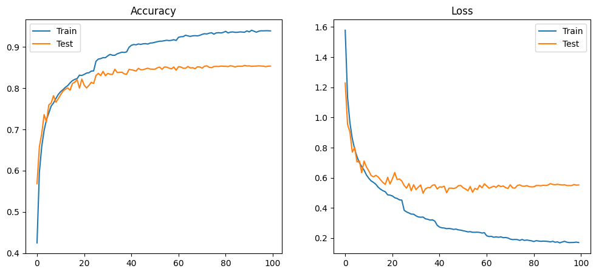

# Hardware-Accelerated Image Processing and Neural Network Inference in Verilog


**High-Level Summary of All Repositories**
Explore an overview of my repositories here: [GitHub - Mummanajagadeesh](https://github.com/Mummanajagadeesh/#:~:text=Verilog%20HDL%20Toolkit%20for%20Image%20Processing%20and%20Neural%20Network%20Acceleration)

**In-Depth Documentation of Subprojects**
Detailed documentation for each subproject can be found here: [Subprojects Documentation](https://mummanajagadeesh.github.io/projects/improve/subprojects/)


**Author:** Mummana Jagadeesh  
**Affiliation:** National Institute of Technology Calicut (NIT Calicut)

---

## Abstract

This project presents a modular hardware acceleration framework for image processing and neural network inference, implemented entirely in Verilog HDL and synthesized using open-source tools. The framework integrates image preprocessing modules, arithmetic acceleration units, and neural network architectures to support efficient computation in embedded vision systems. Preprocessing operations including filtering, resizing, and edge detection were designed as standalone Verilog blocks and applied for character recognition tasks. A finite-state machine controlled multilayer perceptron (MLP) was implemented for Extended-MNIST, achieving over 90% training accuracy in software and \~75% accuracy in hardware simulation. A lightweight convolutional neural network (CNN) for CIFAR-10 was developed, with the first convolutional layer accelerated using a systolic array of multiply-accumulate (MAC) units built from modified Booth encoders and carry-save adders. Additionally, softmax activation was implemented using three approaches: native exponential, Taylor series expansion, and CORDIC-based exponentiation. Accuracy, quantization trade-offs, and synthesis statistics are reported. Future extensions include deeper systolic mapping of CNNs, FIFO-based pipelining, posit arithmetic, and FPGA deployment.

---

## I. Introduction

The increasing adoption of embedded vision systems requires low-latency, energy-efficient computation for applications such as character recognition and image classification. While software frameworks like PyTorch and TensorFlow provide flexibility, their deployment on resource-constrained devices often incurs significant power and latency overhead. Hardware description languages (HDLs) allow for fine-grained control of parallelism, arithmetic precision, and memory access, but demand careful design to balance accuracy and efficiency.

This work introduces a unified framework for hardware-accelerated image processing and neural network inference in Verilog. Unlike prior FPGA accelerators that rely on proprietary toolchains, our framework leverages only open-source EDA tools, including Icarus Verilog and Yosys, for simulation and synthesis.

**Contributions:**

1. Hardware implementations of image preprocessing algorithms (edge detection, Gaussian filtering, ROI extraction, resizing).
2. Hardware-efficient arithmetic units: CORDIC for activation functions, Taylor-series softmax approximations, and MACs based on Modified Booth Encoding (MBE) with Carry-Save Adders (CSA).
3. A systolic array architecture tailored for 3×3 convolution kernels.
4. Neural network inference in hardware: an MLP for Extended-MNIST and a CNN for CIFAR-10.
5. End-to-end automation via Tcl/Perl scripting for preprocessing and inference, and a real-time Tkinter GUI for user-driven MLP testing.

---

## II. Image Processing Modules

Fundamental image preprocessing algorithms were developed in Verilog as memory-based modules. These include:

* **Edge detection** using convolution kernels.
* **Gaussian filtering** for noise reduction.
* **Region-of-interest (ROI) extraction** for isolating handwritten characters.
* **Resizing** for normalization of input images.

These modules serve both as standalone hardware blocks and as preprocessing stages for the MLP application on Extended-MNIST.

**[TAB I: MLP Image Preprocessing Stages]**

| **Original** | **Downscaled (28×28)** | **Grayscale** | **Contrasted** |
|--------------|------------------------|----------------|-----------------|
|  |  |  |  |

| **Edge Detection** | **Bounding Box** | **Box Overlayed** | **Region of Interest** |
|--------------------|------------------|--------------------|--------------------------|
|  |  |  |  |

| **ROI Zoom to Fit** | **ROI Resized 28x28** | **ROI Padded** | **Inverted** |
|----------------------|------------------|----------------|---------------|
|  |  |  |  |

| **Mirrored (Vertical Axis)** | **Rotated 90° CCW** |
|-------------------------------|---------------------|
|  |  |


---

## III. Arithmetic Acceleration Units

### A. CORDIC-Based Exponential and Softmax

The softmax activation was implemented using three approaches in fixed-point arithmetic:

1. **Native exponential** via `$exp`.
2. **Taylor-series expansion** of exponential with configurable series depth.
3. **CORDIC-based approximation** for hardware-efficient exponentiation.

A trade-off analysis was conducted to evaluate classification accuracy versus resource utilization.

**\[FIG 1: Accuracy vs approximation method]**
**\[TAB II: Trade-off table: terms vs accuracy vs area vs delay]**

| **Sample Size** | **Floating-Point (IEEE 754)** | **Fixed-Point (64-bit)**     |
| --------------- | ----------------------------- | ---------------------------- |
| 10 samples      | 9 correct (90% accuracy)      | 8 correct (80% accuracy)     |
| 100 samples     | 76 correct (76% accuracy)     | 64 correct (64% accuracy)    |
| 1000 samples    | 737 correct (73.7% accuracy)  | 658 correct (65.8% accuracy) |

| Fixed Point (binary64) | X = 10 | X = 100 | X = 1000 |
|------------------------|--------|---------|----------|
| Confusion Matrix |  |  |  |

| Floating Point (ieee754) | X = 10 | X = 100 | X = 1000 |
|--------------------------|--------|---------|----------|
| Confusion Matrix |  |  |  |


---

### B. Multiply-Accumulate Units (MACs)

The MAC units were implemented using **Modified Booth Encoding (MBE)** multipliers combined with **Carry-Save Adders (CSA)** for partial product reduction. This design minimizes critical path delay and improves resource efficiency compared to classical Booth + Kogge-Stone implementations.

**\[TAB III: Yosys comparison of MAC designs (Booth+Kogge-Stone vs MBE+CSA)]**

Modified Booth Multiplier + Carry Save Adder based MAC

```bash

3. Executing HIERARCHY pass (managing design hierarchy).

3.1. Analyzing design hierarchy..
Top module:  \systolic_array
Used module:     \pe
Used module:         \mac_unit
Used module:             \carry_save_adder
Used module:             \booth_multiplier

3.2. Analyzing design hierarchy..
Top module:  \systolic_array
Used module:     \pe
Used module:         \mac_unit
Used module:             \carry_save_adder
Used module:             \booth_multiplier
Removed 0 unused modules.

10. Printing statistics.

=== booth_multiplier ===

   Number of wires:                 42
   Number of wire bits:            350
   Number of public wires:           8
   Number of public wire bits:     115
   Number of memories:               0
   Number of memory bits:            0
   Number of processes:              0
   Number of cells:                 42
     $add                            3
     $eq                            21
     $neg                            8
     $pmux                           4
     $reduce_or                      6

=== carry_save_adder ===

   Number of wires:                 10
   Number of wire bits:            160
   Number of public wires:           5
   Number of public wire bits:      80
   Number of memories:               0
   Number of memory bits:            0
   Number of processes:              0
   Number of cells:                  7
     $and                            3
     $or                             2
     $xor                            2

=== mac_unit ===

   Number of wires:                  8
   Number of wire bits:            112
   Number of public wires:           8
   Number of public wire bits:     112
   Number of memories:               0
   Number of memory bits:            0
   Number of processes:              0
   Number of cells:                  3
     $add                            1
     booth_multiplier                1
     carry_save_adder                1

=== pe ===

   Number of wires:                 15
   Number of wire bits:             88
   Number of public wires:          10
   Number of public wire bits:      83
   Number of memories:               0
   Number of memory bits:            0
   Number of processes:              0
   Number of cells:                 10
     $adff                           3
     $adffe                          1
     $logic_and                      1
     $logic_not                      2
     $not                            1
     $reduce_and                     1
     mac_unit                        1

=== systolic_array ===

   Number of wires:                 37
   Number of wire bits:            330
   Number of public wires:          28
   Number of public wire bits:     262
   Number of memories:               0
   Number of memory bits:            0
   Number of processes:              0
   Number of cells:                 19
     $add                            1
     $adff                           5
     $adffe                          1
     $eq                             3
     $lt                             1
     $pmux                           4
     pe                              4

=== design hierarchy ===

   systolic_array                    1
     pe                              4
       mac_unit                      1
         booth_multiplier            1
         carry_save_adder            1

   Number of wires:                337
   Number of wire bits:           3170
   Number of public wires:         152
   Number of public wire bits:    1822
   Number of memories:               0
   Number of memory bits:            0
   Number of processes:              0
   Number of cells:                251
     $add                           17
     $adff                          17
     $adffe                          5
     $and                           12
     $eq                            87
     $logic_and                      4
     $logic_not                      8
     $lt                             1
     $neg                           32
     $not                            4
     $or                             8
     $pmux                          20
     $reduce_and                     4
     $reduce_or                     24
     $xor                            8


5 modules:
  booth_multiplier
  carry_save_adder
  mac_unit
  pe
  systolic_array

```
Booth Multiplier + Kogge Stone Adder based MAC


```bash

=== $paramod\booth_multiplier\WIDTH=s32'00000000000000000000000000001000 ===

   Number of wires:                 43
   Number of wire bits:            486
   Number of public wires:           7
   Number of public wire bits:      98
   Number of memories:               0
   Number of memory bits:            0
   Number of processes:              0
   Number of cells:                 37
     $add                            7
     $eq                            14
     $mux                            1
     $pmux                           7
     $sub                            8

=== $paramod\kogge_stone_adder\WIDTH=s32'00000000000000000000000000010000 ===

   Number of wires:                 59
   Number of wire bits:            269
   Number of public wires:          14
   Number of public wire bits:     224
   Number of memories:               0
   Number of memory bits:            0
   Number of processes:              0
   Number of cells:                124
     $and                           77
     $or                            45
     $xor                            2

=== mac_unit ===

   Number of wires:                 11
   Number of wire bits:             85
   Number of public wires:          10
   Number of public wire bits:      84
   Number of memories:               0
   Number of memory bits:            0
   Number of processes:              0
   Number of cells:                  5
     $adff                           1
     $adffe                          1
     $mux                            1
     $paramod\booth_multiplier\WIDTH=s32'00000000000000000000000000001000      1
     $paramod\kogge_stone_adder\WIDTH=s32'00000000000000000000000000010000      1

=== design hierarchy ===

   mac_unit                          1
     $paramod\booth_multiplier\WIDTH=s32'00000000000000000000000000001000      1
     $paramod\kogge_stone_adder\WIDTH=s32'00000000000000000000000000010000      1

   Number of wires:                113
   Number of wire bits:            840
   Number of public wires:          31
   Number of public wire bits:     406
   Number of memories:               0
   Number of memory bits:            0
   Number of processes:              0
   Number of cells:                164
     $add                            7
     $adff                           1
     $adffe                          1
     $and                           77
     $eq                            14
     $mux                            2
     $or                            45
     $pmux                           7
     $sub                            8
     $xor                            2


3 modules:
  $paramod\booth_multiplier\WIDTH=s32'00000000000000000000000000001000
  $paramod\kogge_stone_adder\WIDTH=s32'00000000000000000000000000010000
  mac_unit
```

---

### C. Systolic Array for Convolution

A 2D systolic array was first designed for general matrix multiplication and extended to **direct 3×3 convolution**. Feature map pixels and kernel weights propagate through the array, enabling parallel MAC operations and local reuse of data.

* Configured specifically for 3×3 kernels.
* Evaluated on the first convolutional layer of CIFAR-10 CNN.
* Demonstrated scaling efficiency across different systolic dimensions.

**\[FIG 2: Systolic array architecture diagram]**
**\[TAB IV: Yosys stats for systolic array sizes, throughput]**

---

## IV. Neural Network Implementations

### A. Multi-Layer Perceptron for Extended-MNIST

A fully FSM-controlled 3-layer perceptron (784–256–128–62, \~242k parameters) was implemented for Extended-MNIST.

* Software training accuracy: >90%.
* Hardware simulation accuracy: \~75%.
* Automated preprocessing + inference pipeline via Tcl/Perl.
* Real-time user testing with Tkinter GUI.

#### Intermediate Value Range Analysis and Bit-Width Estimation

Using simulation on sample images, I observed the minimum and maximum values of intermediate outputs in each layer as follows:

| Layer          | Minimum Value              | Maximum Value           |
| -------------- | -------------------------- | ----------------------- |
| Hidden Layer 1 | 0                        | 108,763.886139          |
| Hidden Layer 2 | 0                       | 2,829,852,679.626373    |
| Output Layer   | -58,500,687,594,725.3047 | 32,406,642,115,926.8281 |

**The minimum value is 0 because ReLU truncates negative values to 0**

I then calculated the number of bits required to represent these maximum magnitudes, including sign bit:

* For Hidden Layer 1:

$$
\lceil \log_2(108,763.886139) \rceil = 17 \text{ bits}
$$

* For Hidden Layer 2:

$$
\lceil \log_2(2,829,852,679.626373) \rceil = 32 \text{ bits}
$$

* For Output Layer (taking the largest absolute value from min/max):

$$
\lceil \log_2(58,500,687,594,725.3047) \rceil = 46 \text{ bits}
$$

#### Fixed-Point Format Selection

To maintain approximately 4 decimal digits of precision, I assigned 14 fractional bits for all layers. Therefore, the fixed-point formats I selected are:

| Layer          | Format | Integer Bits | Fractional Bits | Total Bits | Comments                        |
| -------------- | ------ | ------------ | --------------- | ---------- | ------------------------------- |
| Hidden Layer 1 | Q17.14 | 17           | 14              | 31         | Fits into 32-bit signed integer |
| Hidden Layer 2 | Q32.14 | 32           | 14              | 46         | Requires 64-bit signed integer  |
| Output Layer   | Q46.14 | 46           | 14              | 60         | Requires 64-bit signed integer  |


---

**\[FIG 3: MLP training curves (accuracy/loss)]**
**\[TAB V: Accuracy comparison – software vs hardware]**

---

### B. Convolutional Neural Network for CIFAR-10

A lightweight CNN was implemented with architecture \[(Conv2D×2 + MaxPool)×3 → GAP → Dense(10)].

* **Only the first convolutional layer** was accelerated using the systolic array.
* Custom ROM variants were used to store convolutional weights (2D, flattened, handshake-enabled).
* Accuracy results:

  * FP32: \~84%
  * Q1.31: \~84%
  * Q1.15: \~84%
  * Q1.7: \~83%
  * Q1.3: \~65%


##### **MODEL_ARCH_1**


\[ (Conv2D → BN)×2 → MaxPool → Dropout(0.3) ]<br>
→ \[ (Conv2D → BN)×2 → MaxPool → Dropout(0.4) ]<br>
→ \[ (Conv2D → BN)×2 → MaxPool → Dropout(0.5) ]<br>
→ Flatten → Dense(512) → BN → Dropout(0.5) → Dense(10, softmax)


- **Number of Parameters:** `3,251,018`  
- **Test Accuracy:** `90.91%`


---

##### **MODEL_ARCH_2**


\[ (Conv2D(32) → BN)×2 → MaxPool → Dropout(0.25) ]<br>
→ \[ (Conv2D(64) → BN)×2 → MaxPool → Dropout(0.35) ]<br>
→ \[ (Conv2D(128) → BN)×2 → MaxPool → Dropout(0.4) ]<br>
→ Flatten → Dense(256) → BN → Dropout(0.5) → Dense(10, softmax)


- **Number of Parameters:** `815,530`  
- **Test Accuracy:** `88.84%`


---

##### **MODEL_ARCH_3**


\[ Conv2D(32)×2 → MaxPool ]<br>
→ \[ Conv2D(64)×2 → MaxPool ]<br>
→ \[ Conv2D(96) → MaxPool ]<br>
→ Flatten → Dense(256) → Dense(10, softmax)


- **Number of Parameters:** `517,002`  
- **Test Accuracy:** `85.53%`




---

##### **MODEL_ARCH_4**


\[ Conv2D(16)×2 → MaxPool ]<br>
→ \[ Conv2D(32)×2 → MaxPool ]<br>
→ \[ Conv2D(64)×2 → MaxPool ]<br>
→ GAP → Dense(10, softmax)


- **Number of Parameters:** `72,730`  
- **Test Accuracy:** `83.05%`


---

#### Model Architecture Summary

| Model ID        | Number of Parameters | Test Accuracy (%) | Model Size (MB) |
| --------------- | -------------------- | ----------------- | --------------- |
| **MODEL_ARCH_1** | 3,251,018            | 90.91             | 12.40           |
| **MODEL_ARCH_2** | 815,530              | 88.84             | 3.11            |
| **MODEL_ARCH_3** | 517,002              | 85.53             | 1.97            |
| **MODEL_ARCH_4** | 72,730               | 83.05             | 0.28            |

> *Model size calculated assuming 32-bit floating-point weights (`params × 4 bytes ÷ 1024²`).*


**\[FIG 4: CNN training curves, accuracy vs quantization]**
**\[TAB VI: Accuracy vs arithmetic representation]**
**\[TAB VII: Yosys stats for CNN modules]**

---

## V. Workflow Automation and GUI

* **Toolchain:** Icarus Verilog for simulation; Yosys for synthesis reports (area, LUTs, FFs). No timing analysis performed.
* **Automation:** Tcl/Perl scripts for MLP to handle preprocessing, weight export, Verilog simulation, and results collection.
* **GUI:** Tkinter-based interface enabling real-time handwritten digit input for MLP inference.

**\[FIG 5: GUI screenshot with sample input/output]**

### MLP 


### CNN


---

## VI. Results and Discussion

* Image processing modules provide low-latency, hardware-friendly preprocessing for character recognition.
* CORDIC + Taylor approximations demonstrate viable trade-offs for implementing softmax efficiently.
* MBE+CSA MAC units outperform Booth+Kogge-Stone in terms of synthesis resources.
* The systolic array achieves significant speedup for 3×3 convolution, though currently applied only to the first CNN layer.
* Quantization experiments confirm that fixed-point arithmetic (Q15, Q31) preserves accuracy while reducing resource usage compared to FP32.

**\[TAB VIII: Consolidated synthesis results: MAC, systolic array, CNN, MLP]**


#### YOSYS SYNTHESIS STATS (ONLY 1ST CONV)

```bash
   Number of wires:                181
   Number of wire bits:           2514
   Number of public wires:          39
   Number of public wire bits:     422
   Number of memories:               0
   Number of memory bits:            0
   Number of processes:              0
   Number of cells:                165
     $add                           16
     $adff                           5
     $adffe                         14
     $dffe                           5
     $eq                            12
     $ge                             3
     $logic_not                      2
     $logic_or                       3
     $lt                             9
     $mul                            6
     $mux                           41
     $ne                            13
     $neg                            2
     $not                            3
     $pmux                          11
     $reduce_and                    12
     $reduce_bool                    5
     $reduce_or                      1
     $sub                            2


1 modules:
  conv2d_mem
  
```

* **Module Definition**: `conv2d_mem`

  * **Parameters**: `WIDTH`, `HEIGHT`, `CHANNELS`, `FILTERS`, `K`, `PAD`, `BIAS_MODE_POST_ADD`.
  * **Ports**: `clk`, `rst`, `start`, `done`, memory interfaces, and `out_data` output stream.

* **Image ROM interface**

  * `image_addr`, `image_addr_valid`, `image_addr_ready` → control signals for address request.
  * `image_r_data`, `image_g_data`, `image_b_data`, `image_data_valid` → pixel data from memory.
  * `image_data_ready` → handshake back to memory.

* **Kernel ROM interface**

  * `kernel_addr`, `kernel_addr_valid`, `kernel_addr_ready` → kernel coefficient fetch.
  * `kernel_data`, `kernel_data_valid`, `kernel_data_ready` → coefficient value transfer.

* **Bias ROM interface**

  * `bias_addr`, `bias_addr_valid`, `bias_addr_ready` → bias fetch.
  * `bias_data`, `bias_data_valid`, `bias_data_ready` → bias value transfer.

* **Output stream**

  * `out_data` (32-bit convolution output), `out_valid` (valid strobe).

* **Counters and indices**

  * `f` = filter index, `i` = row index, `j` = column index.
  * `m`, `n`, `c` = kernel indices (row, col, channel).
  * `in_x`, `in_y` = input coordinates for convolution.
  * `kernel_row` = computed index for kernel access.

* **Datapath registers**

  * `accum` (64-bit accumulator), `kernel_mul` (48-bit multiply result).
  * `out_int`, `out_int_relu` → final processed outputs.
  * `pix_signed`, `kern16`, `bias16` → signed extensions of input, kernel, bias.
  * Latched memory outputs: `image_r_q`, `image_g_q`, `image_b_q`, `kernel_q`, `bias_q`.

* **FSM (Finite State Machine)**

  * `state` register (6 bits).
  * **Localparams** define FSM states:

    * `S_IDLE`, `S_START_FILTER`, `S_BIAS_REQ`, `S_BIAS_WAIT`, `S_SETUP_PIXEL`,
      `S_MAC_DECIDE`, `S_IMG_REQ`, `S_IMG_WAIT`, `S_KERN_REQ`, `S_KERN_WAIT`,
      `S_MAC_ACCUM`, `S_PIXEL_DONE`, `S_NEXT_PIXEL`, `S_NEXT_FILTER`, `S_DONE`.

* **Reset logic**

  * Initializes FSM to `S_IDLE`.
  * Clears counters, output signals, addresses, and accumulator.

* **FSM behavior**

  * `S_IDLE`: Wait for `start`.
  * `S_START_FILTER` / `S_BIAS_REQ`: Request bias for current filter.
  * `S_BIAS_WAIT`: Wait for bias to be valid, latch into `bias_q`.
  * `S_SETUP_PIXEL`: Reset accumulator, set pixel iteration counters.
  * `S_MAC_DECIDE`: Calculate input pixel position (with padding check).
  * `S_IMG_REQ` / `S_IMG_WAIT`: Fetch image data.
  * `S_KERN_REQ` / `S_KERN_WAIT`: Fetch kernel weight.
  * `S_MAC_ACCUM`: Multiply-accumulate pixel × weight, update `accum`.
  * `S_PIXEL_DONE`: Apply bias, normalization, ReLU, set `out_data`.
  * `S_NEXT_PIXEL`: Iterate over `j`, `i` for next pixel.
  * `S_NEXT_FILTER`: Increment filter index `f`.
  * `S_DONE`: Assert `done` after all pixels and filters are computed.

* **Bias handling**

  * Controlled by `BIAS_MODE_POST_ADD` parameter.
  * Option for post-addition bias vs scaled bias.

* **Output processing**

  * Converts accumulator to 32-bit (`out_int`).
  * Applies bias.
  * Applies **ReLU activation** (clamp negative to zero).
  * Valid output signaled with `out_valid`.


<div style="display: flex; gap: 20px;">

  <!-- ROM 00 conv2d bias -->
  <div>
    <h5>rom_00_conv2d_bias</h5>
    <pre>
==== VIEW A: after frontend (before lowering) ====
Number of wires:                 16
Number of wire bits:             46
Number of public wires:           9
Number of public wire bits:      22
Number of memories:               1
Number of memory bits:          128
Number of processes:              2
Number of cells:                  4
  $logic_and                      2
  $meminit_v2                     1
  $memrd                          1

==== VIEW B: after memory -nomap (abstract memories kept) ====
Number of wires:                 17
Number of wire bits:             48
Number of public wires:           8
Number of public wire bits:      18
Number of memories:               0
Number of memory bits:            0
Number of processes:              0
Number of cells:                 12
  $adff                           2
  $dff                            1
  $logic_and                      2
  $mem_v2                         1
  $mux                            6

==== VIEW C: after synth_xilinx (tech-mapped) ====
Number of wires:                 19
Number of wire bits:             52
Number of public wires:           8
Number of public wire bits:      18
Number of memories:               0
Number of memory bits:            0
Number of processes:              0
Number of cells:                 36
  BUFG                            1
  FDCE                            1
  FDPE                            1
  FDRE                            6
  IBUF                            8
  LUT3                            1
  LUT4                            8
  OBUF                           10
    </pre>
  </div>

  <!-- ROM 00 conv2d kernel -->
  <div>
    <h5>rom_00_conv2d_kernel</h5>
    <pre>
==== VIEW A: after frontend (before lowering) ====
Number of wires:                 16
Number of wire bits:             61
Number of public wires:           9
Number of public wire bits:      32
Number of memories:               1
Number of memory bits:         3456
Number of processes:              2
Number of cells:                  4
  $logic_and                      2
  $meminit_v2                     1
  $memrd                          1

==== VIEW B: after memory -nomap (abstract memories kept) ====
Number of wires:                 17
Number of wire bits:             53
Number of public wires:           8
Number of public wire bits:      23
Number of memories:               0
Number of memory bits:            0
Number of processes:              0
Number of cells:                 12
  $adff                           2
  $dff                            1
  $logic_and                      2
  $mem_v2                         1
  $mux                            6

==== VIEW C: after synth_xilinx (tech-mapped) ====
Number of wires:                 99
Number of wire bits:            186
Number of public wires:           8
Number of public wire bits:      23
Number of memories:               0
Number of memory bits:            0
Number of processes:              0
Number of cells:                142
  BUFG                            1
  FDCE                            1
  FDPE                            1
  FDRE                            8
  IBUF                            13
  LUT2                            4
  LUT3                            1
  LUT4                            2
  LUT5                            1
  LUT6                           62
  MUXF7                          30
  MUXF8                           8
  OBUF                           10
    </pre>
  </div>

  <!-- Image B ROM -->
  <div>
    <h5>image_b_rom</h5>
    <pre>
==== VIEW A: after frontend (before lowering) ====
Number of wires:                 17
Number of wire bits:             65
Number of public wires:           9
Number of public wire bits:      34
Number of memories:               1
Number of memory bits:         8192
Number of processes:              2
Number of cells:                  5
  $logic_and                      2
  $logic_not                      1
  $meminit_v2                     1
  $memrd                          1

==== VIEW B: after memory -nomap (abstract memories kept) ====
Number of wires:                 22
Number of wire bits:             86
Number of public wires:           9
Number of public wire bits:      34
Number of memories:               0
Number of memory bits:            0
Number of processes:              0
Number of cells:                 17
  $dff                            4
  $logic_and                      2
  $logic_not                      1
  $mem_v2                         1
  $mux                            9

==== VIEW C: after synth_xilinx (tech-mapped) ====
Number of wires:                243
Number of wire bits:            504
Number of public wires:           9
Number of public wire bits:      34
Number of memories:               0
Number of memory bits:            0
Number of processes:              0
Number of cells:                360
  BUFG                            1
  FDRE                           28
  IBUF                           14
  LUT2                            5
  LUT3                            7
  LUT4                            6
  LUT5                           23
  LUT6                          160
  MUXF7                          86
  MUXF8                          20
  OBUF                           10
    </pre>
  </div>

</div>


##### **Bias ROM: `rom_00_conv2d_bias`**

* **Views**

  * **VIEW A (Frontend)** – memory still modeled as abstract `mem` with initialization.
  * **VIEW B (After memory -nomap)** – abstract memory removed, lowered into registers + logic.
  * **VIEW C (After synth\_xilinx)** – mapped to FPGA primitives (LUTs, FFs, buffers).

* **Module Definition**: `rom_00_conv2d_bias`

  * A small ROM that stores bias values for convolution filters.
  * Single-port memory with initialization (`$meminit_v2`).

* **Resource breakdown**

  * **VIEW A**:

    * 1 memory, 128 bits total.
    * 2 processes (for initialization and read).
    * Simple logic (`$logic_and`, `$memrd`).
  * **VIEW B**:

    * Memory flattened → 0 memories, instead implemented as FFs + MUX network.
    * 12 cells total (2 `$adff`, 1 `$dff`, 6 `$mux`).
  * **VIEW C**:

    * Fully mapped to FPGA primitives.
    * 36 cells total:

      * **Sequential logic**: 1 `FDCE`, 1 `FDPE`, 6 `FDRE` (flip-flops).
      * **Combinational logic**: LUT3, LUT4 for addressing.
      * **I/O**: 8 `IBUF`, 10 `OBUF`.
      * **Clocking**: 1 `BUFG`.

* **Summary**:
  The bias ROM is small (128-bit storage), flattened into a few LUTs + registers. It’s essentially a lookup table of per-filter biases, fetched during convolution setup.

---

##### **Kernel ROM: `rom_00_conv2d_kernel`**

* **Views**

  * **VIEW A (Frontend)** – large memory still intact.
  * **VIEW B (After memory -nomap)** – memory lowered into muxes + registers.
  * **VIEW C (After synth\_xilinx)** – mapped into FPGA LUTs, MUXF7/F8 cascade for wide ROM.

* **Module Definition**: `rom_00_conv2d_kernel`

  * Stores kernel weights for convolution (coefficients).
  * Much larger than bias ROM: 3456 bits total.

* **Resource breakdown**

  * **VIEW A**:

    * 1 memory (3456 bits).
    * 2 processes, 4 cells.
  * **VIEW B**:

    * Memory lowered → muxes + FFs.
    * 12 cells total (same pattern as bias: 2 `$adff`, 1 `$dff`, 6 `$mux`).
  * **VIEW C**:

    * Large expansion into **142 FPGA cells**.
    * Breakdown:

      * **Sequential logic**: 1 `FDCE`, 1 `FDPE`, 8 `FDRE`.
      * **Combinational logic**: 62 `LUT6`, plus smaller LUTs (LUT2, LUT3, LUT4, LUT5).
      * **Wide mux structures**: 30 `MUXF7`, 8 `MUXF8` (used to build large ROM).
      * **I/O**: 13 `IBUF`, 10 `OBUF`.
      * **Clocking**: 1 `BUFG`.

* **Summary**:
  The kernel ROM is significantly larger than the bias ROM (3456 vs 128 bits). After mapping, it consumes many LUT6s and cascaded multiplexers (MUXF7/MUXF8), which is typical for FPGA ROM inference. This block dominates the logic footprint compared to bias.


##### **Blue Channel ROM: `image_b_rom`**

* **Views**

  * **VIEW A (Frontend)** – memory modeled as abstract `$mem` with initialization.
  * **VIEW B (After memory -nomap)** – memory lowered into registers and combinational logic.
  * **VIEW C (After synth\_xilinx)** – mapped to FPGA primitives (LUTs, FFs, buffers).

* **Module Definition**: `image_b_rom`

  * Stores the blue channel pixel values for an image block.
  * Single-port memory initialized via `$meminit_v2`.

* **Resource breakdown**

  * **VIEW A**:

    * 1 memory, 8192 bits total.
    * 2 processes (initialization and read).
    * Simple logic: `$logic_and`, `$logic_not`, `$memrd`.
    * Total 5 cells.

  * **VIEW B**:

    * Memory flattened → 0 memories, replaced by flip-flops + mux network.
    * Total 17 cells:

      * 4 `$dff` (flip-flops for state storage)
      * 2 `$logic_and`, 1 `$logic_not`
      * 1 `$mem_v2`
      * 9 `$mux` (address/data selection)

  * **VIEW C**:

    * Fully mapped to FPGA primitives.
    * Total 360 cells:

      * **Sequential logic**: 28 `FDRE` flip-flops.
      * **Combinational logic**: 5 `LUT2`, 7 `LUT3`, 6 `LUT4`, 23 `LUT5`, 160 `LUT6`.
      * **MUX cascades**: 86 `MUXF7`, 20 `MUXF8`.
      * **I/O**: 14 `IBUF`, 10 `OBUF`.
      * **Clocking**: 1 `BUFG`.

* **Summary**:

  The blue channel ROM is large (8192 bits) and dominates logic usage after tech mapping. It is fully flattened into LUTs, flip-flops, and cascaded multiplexers to implement read access efficiently. Its structure and resource usage are typical for storing image pixel data in FPGA designs.


---

## VII. Future Work

Future directions include:

1. Extending systolic convolution mapping to all CNN layers.
2. FIFO buffer design for inter-layer pipelining.
3. Exploration of posit arithmetic as an alternative to IEEE-754 and fixed-point.
4. Object detection on Pascal VOC dataset using shallow CNNs.
5. FPGA deployment for real-time evaluation.

---

## VIII. Conclusion

This work demonstrates a modular, fully Verilog-based framework for image processing and neural network inference using only open-source tools. By combining preprocessing modules, arithmetic accelerators, systolic convolution, and neural inference pipelines, the framework achieves competitive accuracy while remaining hardware-efficient. The integration of automation scripts and real-time GUI testing further bridges software and hardware workflows, highlighting the feasibility of HDL-based machine learning acceleration in embedded vision systems.

---

## References

\[1] Y.-H. Chen et al., “Eyeriss: An Energy-Efficient Reconfigurable Accelerator for Deep Convolutional Neural Networks,” *IEEE JSSC*, 2016.

\[2] J. Gustafson, “Posit Arithmetic: A Better Way to Compute,” *ArXiv preprint arXiv:1907.01036*, 2019.

\[3] A. Krizhevsky, “Learning Multiple Layers of Features from Tiny Images,” *CIFAR-10 Technical Report*, 2009.

\[4] G. Cohen et al., “EMNIST: An Extension of MNIST to Handwritten Letters,” *ArXiv preprint arXiv:1702.05373*, 2017.

\[5] Open-source EDA: Icarus Verilog, YosysHQ.
